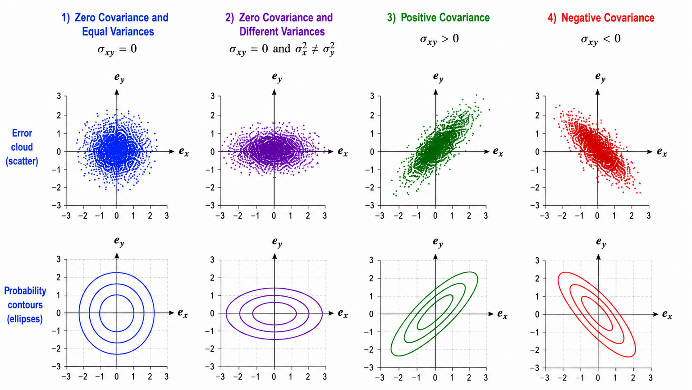

# Introduction

When we estimate a variable, the estimate is rarely perfectly certain. In practice, we should always allow for the possibility that the true value differs from our estimate. In other words, the uncertainty of an estimate is generally not zero.

For a single variable, **variance** is a quantity that describes how uncertain the estimate is, or more precisely, how widely the possible values are spread around the expected value.

When we estimate more than one quantity at the same time, uncertainty can be represented using a **covariance matrix** \(P\).

The central idea of the covariance matrix is:

> A covariance matrix describes not only how uncertain each state variable is, but also how the uncertainties of different variables are related.

From now on, the word **state** will refer to the set of quantities that we are trying to estimate. In state estimation, the state contains the variables needed to describe the condition of the system at a given time.

For example, the state of a mobile robot could be

$$
\mathbf{x} =
\begin{bmatrix}
x \\
y \\
\theta
\end{bmatrix},
$$

where $x$ and $y$ represent the robot position and $\theta$ represents its orientation.

# Variance in 1D

Suppose we estimate a single quantity as

$$
x = 65.
$$

However, we know that this estimate is uncertain. Instead of saying that the value is exactly 65, we can model the possible values using a Gaussian distribution:

$$
x \sim \mathcal{N}(65,10^2),
$$

where

$$
\mu = 65
$$

is the mean, and

$$
\sigma = 10
$$

is the standard deviation.

The corresponding variance is therefore

$$
\sigma^2 = 100.
$$

The bell curve shows the probability density of the different possible values of \(x\). Values close to the mean are more likely, while values farther from the mean are less likely.

  

  <em>Figure 1: Gaussian distribution with μ = 65 and σ = 10.</em>

The variance $\sigma^2$ measures how spread out the possible values are around the mean $\mu$.

A small variance means: **"I'm quite confident about the estimate."**

A large variance means: **"The actual value could be considerably different from the mean."**

For a 1D Gaussian distribution, approximately **68.3%** of the probability lies within one standard deviation of the mean:

$$
\mu - \sigma \leq x \leq \mu + \sigma
$$

and approximately **95.4%** lies within two standard deviations:

$$
\mu - 2\sigma \leq x \leq \mu + 2\sigma.
$$

So far, straightforward.

# Uncertainty in 2D State Estimation

Now, imagine that the state contains two variables:

$$
\mathbf{x} =
\begin{bmatrix}
x \\
y
\end{bmatrix}.
$$

Each variable has its own variance:

$$
\sigma_x^2, \qquad \sigma_y^2.
$$

At first, you might think that the uncertainty of the state could be represented only by these two values:

$$
\begin{bmatrix}
\sigma_x^2 \\
\sigma_y^2
\end{bmatrix}
$$

But this is not enough.

We also need to know:

> Are the estimation errors in \(x\) related to the estimation errors in \(y\)?

This is exactly what **covariance** tells us.

The uncertainty of the complete 2D state is therefore represented by the covariance matrix

$$
P =
\begin{bmatrix}
\sigma_x^2 & \sigma_{xy} \\
\sigma_{yx} & \sigma_y^2
\end{bmatrix},
$$

where

$$
\sigma_{xy} = \mathrm{Cov}(x,y).
$$

The diagonal elements $\sigma_x^2$ and $\sigma_y^2$ are variances, and they tell us how uncertain we are about each variable individually. On the other hand, the off-diagonal elements $\sigma_{xy}$ and $\sigma_{yx}$ are covariances and describe whether the errors in $x$ and $y$ tend to change together in a **linear** sense, but it cannot fully reveal a **nonlinear** dependency.

For covariance matrices,

$$
\sigma_{xy} = \sigma_{yx},
$$

so the covariance matrix is symmetric.

# Covariance Mathematics

Mathematically

$$
\mathrm{Cov}(x,y) = E[(x - \mu_x)(y - \mu_y)].
$$

Let's unpack this expression to understand what it means. We can consider three main cases for each observation:

## Case 1: The deviations tend to have the same sign

For example:

$$
x-\mu_x > 0, \qquad y-\mu_y > 0
$$

or

$$
x-\mu_x < 0, \qquad y-\mu_y < 0.
$$

In both cases, their product is positive. Therefore:

$$
\mathrm{Cov}(x,y) > 0.
$$

This means that when $x$ is above its mean, $y$ also tends to be above its mean, and when $x$ is below its mean, $y$ also tends to be below its mean.

## Case 2: The deviations tend to have opposite signs

For example:

$$
x-\mu_x > 0, \qquad y-\mu_y < 0,
$$

or vice versa.

Their product is negative. This means:

$$
\mathrm{Cov}(x,y) < 0.
$$

This means that when $x$ tends to be above its mean, $y$ tends to be below its mean, and vice versa.

## Case 3: No linear relationship

If positive and negative products tend to cancel each other out, then

$$
\mathrm{Cov}(x,y) \approx 0.
$$

This means that there is little or no **linear relationship** between the deviations of $x$ and $y$.

However, zero covariance does **not necessarily mean that $x$ and $y$ are independent**. They may still have a nonlinear relationship.

# Geometric Interpretation of the Covariance Matrix

Suppose we are estimating a two-variables state again. Therefore, the estimation error contains two components:

$$
\mathbf{e} =
\begin{bmatrix}
e_x \\
e_y
\end{bmatrix},
$$

with covariance matrix

$$
P =
\begin{bmatrix}
\sigma_x^2 & \sigma_{xy} \\
\sigma_{yx} & \sigma_y^2
\end{bmatrix}.
$$

Imagine repeating the same estimation process many times and plotting the resulting error pairs $(e_x,e_y)$ on a 2D plane. This would form a cloud of possible estimation errors. If the estimator is unbiased, then

$$
E[e_x]=E[e_y]=0,
$$

meaning that the error cloud is centered around the origin $(0,0)$.

Now suppose the errors follow a **2D Gaussian distribution**, and we look for 2D points $(e_x,e_y)$ that have the same joint probability density under the 2D Gaussian distribution.

First, consider the case where the covariance is zero:

$$
\sigma_{xy}=\sigma_{yx}=0.
$$

If

$$
\sigma_x^2>\sigma_y^2,
$$

the errors have a larger spread along the $e_x$ direction than along the $e_y$ direction. Therefore, along the $e_x$ direction, we need to move farther from the origin before the probability density decreases to a certain level. Along the $e_y$ direction, the same probability-density level is reached at a smaller distance from the origin. Consequently, the equal-density contour is stretched along the $e_x$ direction and forms an ellipse rather than a circle.

If instead

$$
\sigma_x^2=\sigma_y^2
$$

and the covariance is zero, the spread is identical in both directions, so the equal-density contour becomes a circle.

The covariance matrix determines three important geometric properties of these ellipses:

1. **Size** — the overall amount of uncertainty.
2. **Shape** — how the uncertainty is distributed across different directions.
3. **Orientation** — the directions along which the errors tend to vary together.

The diagonal elements

$$
\sigma_x^2,\qquad \sigma_y^2
$$

describe the individual spreads of the errors along the $x$ and $y$ coordinates.

The off-diagonal elements

$$
\sigma_{xy} = \sigma_{yx}
$$

describe how the two errors vary together and therefore influence the orientation of the uncertainty ellipse.

More precisely, the **eigenvectors** of $P$ determine the directions of the principal axes of the ellipse, while the **eigenvalues** determine the amount of variance along those directions.

Therefore, the principal axes of the ellipse do not necessarily coincide with the original $x$ and $y$ axes.

## Four Typical Cases

The figure below illustrates four useful cases.

  

  <em>Figure 2: Geometric interpretation of different 2D covariance structures.</em>

### 1. Zero Covariance and Equal Variances

If

$$
\sigma_{xy}=0
$$

and

$$
\sigma_x^2=\sigma_y^2,
$$

the uncertainty is the same in every direction.

The probability contours are therefore circles rather than elongated ellipses.

There is no preferred direction of uncertainty.

### 2. Zero Covariance and Different Variances

If

$$
\sigma_{xy}=0
$$

but

$$
\sigma_x^2 \neq \sigma_y^2,
$$

the errors are uncorrelated, but the uncertainty is larger in one coordinate direction than in the other.

The resulting ellipse is aligned with the coordinate axes.

For example, if

$$
\sigma_x^2 > \sigma_y^2,
$$

the ellipse is wider along the $x$ direction.

### 3. Positive Covariance

If

$$
\sigma_{xy}>0,
$$

positive $e_x$ errors tend to occur together with positive $e_y$ errors, while negative $e_x$ errors tend to occur together with negative $e_y$ errors.

The uncertainty ellipse is therefore tilted with a positive slope.

### 4. Negative Covariance

If

$$
\sigma_{xy}<0,
$$

positive $e_x$ errors tend to occur together with negative $e_y$ errors, and vice versa.

The uncertainty ellipse is therefore tilted with a negative slope.

In summary:

> The covariance matrix tells us not only how large the uncertainty is, but also in which directions that uncertainty is distributed. The covariance ellipse is a geometric visualization of this information.
