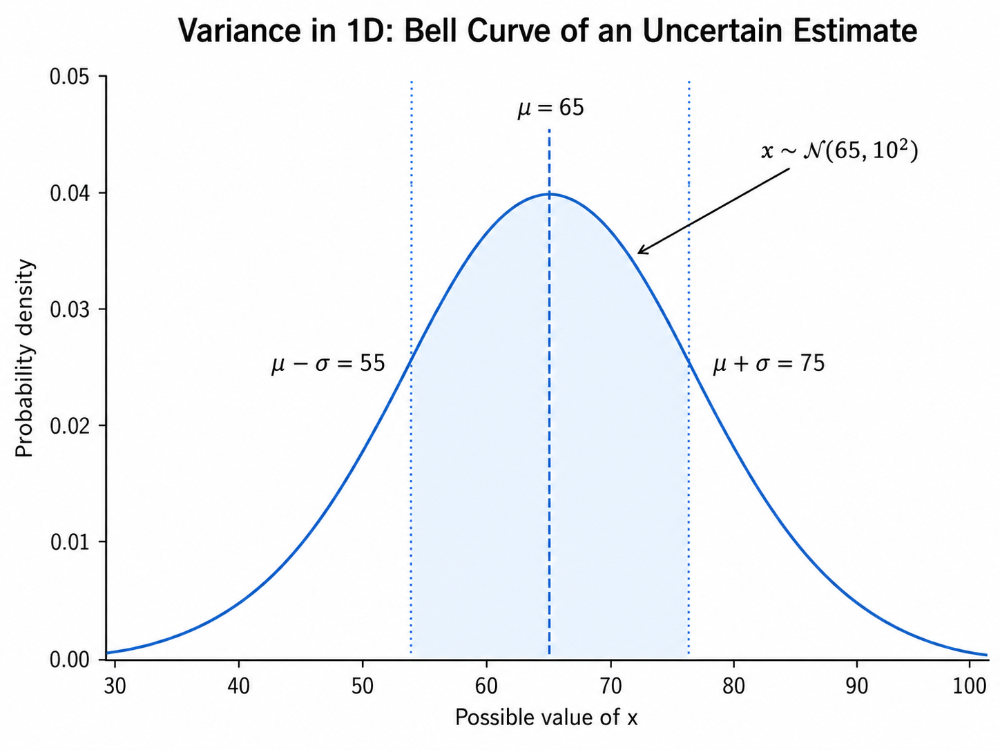

# Introduction

When we estimate a variable, the estimate is rarely perfectly certain. In practice, we should always allow for the possibility that the true value differs from our estimate. In other words, the uncertainty of an estimate is generally not zero.

For a single variable, **variance** is a quantity that describes how uncertain the estimate is, or more precisely, how widely the possible values are spread around the expected value.

When we estimate more than one quantity at the same time, uncertainty can be represented using a **covariance matrix** \(P\).

The central idea of the covariance matrix is:

> A covariance matrix describes not only how uncertain each state variable is, but also how the uncertainties of different variables are related.

From now on, the word **state** will refer to the set of quantities that we are trying to estimate. In state estimation, the state contains the variables needed to describe the condition of the system at a given time.

For example, the state of a mobile robot could be

$$
\mathbf{x} =
\begin{bmatrix}
x \\
y \\
\theta
\end{bmatrix},
$$

where $x$ and $y$ represent the robot position and $\theta$ represents its orientation.

# Variance in 1D

Suppose we estimate a single quantity as

$$
x = 65.
$$

However, we know that this estimate is uncertain. Instead of saying that the value is exactly 65, we can model the possible values using a Gaussian distribution:

$$
x \sim \mathcal{N}(65,10^2),
$$

where

$$
\mu = 65
$$

is the mean, and

$$
\sigma = 10
$$

is the standard deviation.

The corresponding variance is therefore

$$
\sigma^2 = 100.
$$

The bell curve shows the probability density of the different possible values of \(x\). Values close to the mean are more likely, while values farther from the mean are less likely.

  

  <em>Figure 1: Gaussian distribution with μ = 65 and σ = 10.</em>

The variance $\sigma^2$ measures how spread out the possible values are around the mean $\mu$.

A small variance means: **"I'm quite confident about the estimate."**

A large variance means: **"The actual value could be considerably different from the mean."**

For a 1D Gaussian distribution, approximately **68.3%** of the probability lies within one standard deviation of the mean:

$$
\mu - \sigma \leq x \leq \mu + \sigma
$$

and approximately **95.4%** lies within two standard deviations:

$$
\mu - 2\sigma \leq x \leq \mu + 2\sigma.
$$

So far, straightforward.

# Uncertainty in 2D State Estimation

Now, imagine that the state contains two variables:

$$
\mathbf{x} =
\begin{bmatrix}
x \\
y
\end{bmatrix}.
$$

Each variable has its own variance:

$$
\sigma_x^2, \qquad \sigma_y^2.
$$

At first, you might think that the uncertainty of the state could be represented only by these two values:

$$
\begin{bmatrix}
\sigma_x^2 \\
\sigma_y^2
\end{bmatrix}
$$

But this is not enough.

We also need to know:

> Are the estimation errors in \(x\) related to the estimation errors in \(y\)?

This is exactly what **covariance** tells us.

The uncertainty of the complete 2D state is therefore represented by the covariance matrix

$$
P =
\begin{bmatrix}
\sigma_x^2 & \sigma_{xy} \\
\sigma_{yx} & \sigma_y^2
\end{bmatrix},
$$

where

$$
\sigma_{xy} = \operatorname{Cov}(x,y).
$$

The diagonal elements $\sigma_x^2$ and $\sigma_y^2$ are variances. They tell us how uncertain we are about each variable individually, while the off-diagonal elements $\sigma_{xy}$ and $\sigma_{yx}$ are covariances and describe whether the errors in $x$ and $y$ tend to change together.

For covariance matrices,

$$
\sigma_{xy} = \sigma_{yx},
$$

so the covariance matrix is symmetric.
